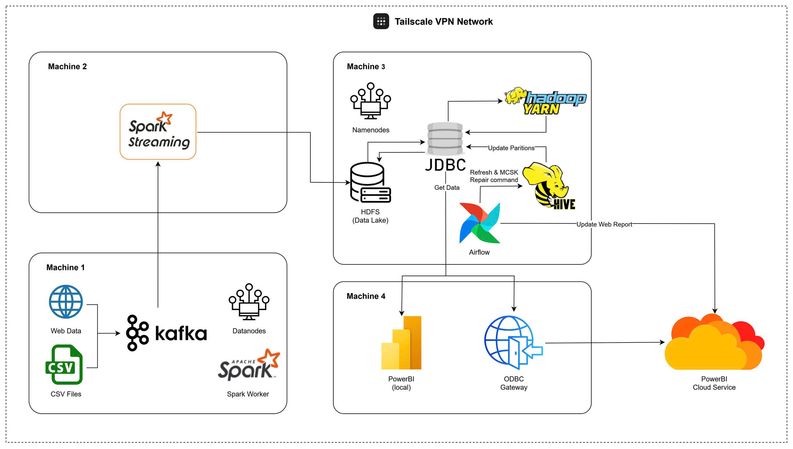
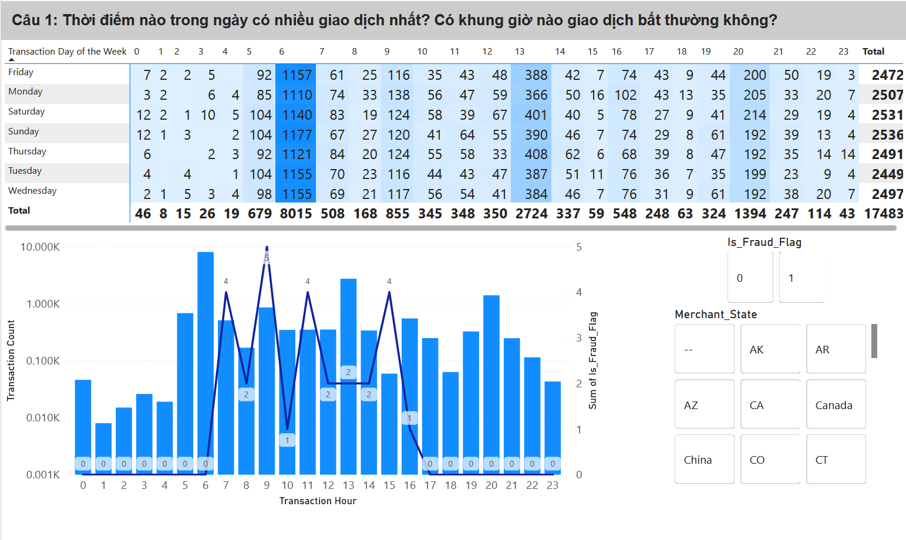
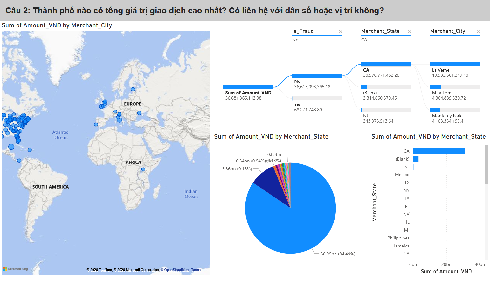
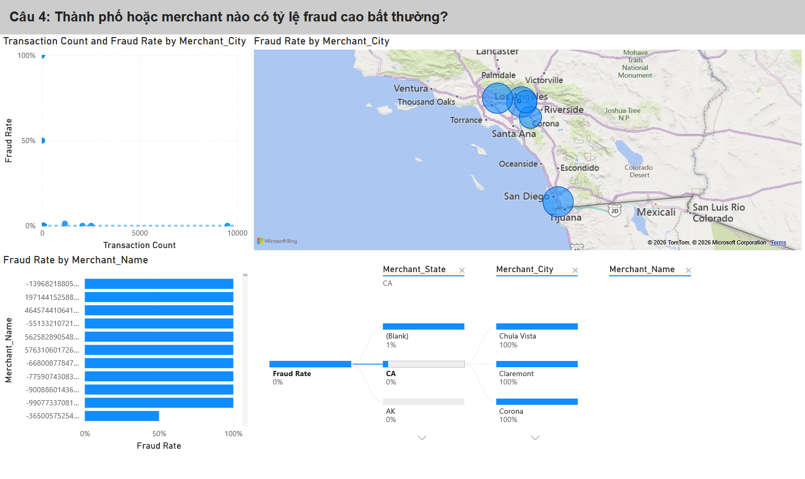

# Xây Dựng Hệ Thống Phát Hiện Gian Lận Thẻ Tín Dụng Thời Gian Thực

> **Đồ án môn học - Khoa Công nghệ Thông tin** > **Trường Đại học Khoa học Tự nhiên - ĐHQG TP.HCM**


## Cấu trúc thư mục
```bash
├── 📁 assets
│   ├── 🖼️ c1.png
│   ├── 🖼️ c2.png
│   ├── 🖼️ c3.png
│   ├── 🖼️ c4.png
│   ├── 🖼️ c5.png
│   └── 🖼️ odap_architecture.jpg
├── 📁 data
│   ├── 📄 User0_credit_card_transactions.csv
│   └── 📄 behavior-based-pseudo-users-synthetic.ipynb
├── 📁 hadoop
│   ├── 📁 config
│   │   ├── ⚙️ .bashrc
│   │   ├── ⚙️ core-site.xml
│   │   ├── 📄 hadoop-env.sh
│   │   ├── ⚙️ hdfs-site.xml
│   │   ├── 📄 hosts.example
│   │   ├── ⚙️ mapred-site.xml
│   │   ├── 📄 workers
│   │   └── ⚙️ yarn-site.xml
│   └── 📁 script
│       └── 📄 start-connector.sh
├── 📁 kafka
│   ├── 📁 config
│   │   └── ⚙️ .bashrc
│   ├── 📁 script
│   │   ├── 📄 create-topic.sh
│   │   └── 📄 reset-state.sh
│   └── 📁 src
│       ├── 🐍 config.py
│       ├── 🐍 producer_exchange_rates.py
│       └── 🐍 producer_transactions.py
├── 📁 powerBI_airflow
│   ├── 📁 res
│   │   └── 📄 odap_powerbi.pbix
│   └── 📁 src
│       └── 🐍 daily_credit_card_pipeline.py
├── 📁 spark
│   ├── 📁 script
│   │   └── 📄 run_spark_streaming.sh
│   └── 📁 src
│       └── 🐍 spark_streaming_main.py
├── ⚙️ .gitignore
└── 📝 README.md
```

## 📖 Giới thiệu (Overview)

Trong bối cảnh thanh toán không dùng tiền mặt bùng nổ, các hệ thống xử lý theo lô (batch processing) truyền thống không còn đủ khả năng phát hiện gian lận tức thì. Dự án này xây dựng một **End-to-End Data Pipeline** xử lý dữ liệu lớn theo thời gian thực (Real-time Big Data Processing).

Hệ thống có khả năng tiếp nhận luồng giao dịch liên tục từ các máy POS giả lập, tích hợp tỷ giá hối đoái thời gian thực, phát hiện/đánh dấu gian lận và trực quan hóa dữ liệu để hỗ trợ ra quyết định kinh doanh.

## 🏗 Kiến trúc hệ thống (Architecture)

<div align="center">
   
   <div style="display: block; margin-top: 10px;">
      <i>Hình 1: Sơ đồ luồng dữ liệu End-to-End của hệ thống.</i>
   </div>
</div>


Hệ thống tuân theo kiến trúc **Lambda Architecture** thu nhỏ, tập trung vào Streaming Processing, triển khai trên cụm **Mini-Cluster gồm 4 Nodes** kết nối qua VPN (Tailscale). Chi tiết ý tưởng và triển khai xem trong `doc/Report.pdf`

### Luồng dữ liệu (Data Flow):
1.  **Ingestion Layer:** 
    * **Transaction Producer:** Giả lập dữ liệu giao dịch từ file CSV, gửi vào Kafka.
    * **Exchange Rate Producer:** Thu thập tỷ giá USD/VND từ Vietcombank (qua API hoặc Web Crawler dự phòng), gửi vào Kafka mỗi 5 phút.
2.  **Processing Layer:** 
    * **Spark Structured Streaming:** Đọc dữ liệu từ Kafka, làm sạch, chuẩn hóa ngày tháng, tính toán số tiền VND theo tỷ giá mới nhất, và đánh dấu gian lận (`Is_Fraud_Flag`).
3.  **Storage Layer:** 
    * **HDFS (Data Lake):** Lưu trữ dữ liệu đã xử lý với định dạng phân vùng (`partitionBy`) theo Năm/Tháng/Ngày.
    * **Optimization:** Sử dụng kỹ thuật `Coalesce(1)` để giải quyết vấn đề "Small File Problem".
4.  **Serving & Analytics Layer:** 
    * **Spark Thrift Server:** Cung cấp cổng kết nối JDBC/ODBC.
    * **Power BI:** Kết nối qua Gateway để cập nhật báo cáo và Dashboard giám sát.
5.  **Orchestration:** 
    * **Apache Airflow:** Lập lịch pipeline, tự động trigger làm mới dataset trên Power BI Cloud.

## 🛠 Công nghệ sử dụng (Tech Stack)

| Thành phần | Công nghệ / Công cụ |
| :--- | :--- |
| **Ngôn ngữ** | Python (PySpark, Playwright, Pandas) |
| **Message Broker** | Apache Kafka |
| **Processing Engine** | Apache Spark (Structured Streaming) |
| **Storage & Resource** | Hadoop HDFS & YARN |
| **Orchestration** | Apache Airflow |
| **Visualization** | Power BI (On-premises Data Gateway, ODBC) |
| **Virtualization/Containerization** | Proxmox VE (LXC), WSL2 (Windows Subsystem for Linux) |
| **Networking** | Tailscale Mesh VPN (Subnet Routing) |
| **Operating Systems** | Fedora Workstation (Physical Worker), Debian/Ubuntu (LXC Containers). |

## ✨ Tính năng chính (Key Features)

* **Xử lý thời gian thực (Real-time Processing):** Độ trễ thấp từ khi giao dịch phát sinh đến khi hiện lên hệ thống.
* **Cập nhật tỷ giá động:** Tự động lấy tỷ giá mới nhất song song với luồng giao dịch mà không gây nghẽn cổ chai (Non-blocking I/O).
* **Cơ chế chịu lỗi (Fault Tolerance):** 
    * Exchange Rate Producer có cơ chế Failover (chuyển từ API sang Crawler nếu lỗi).
    * Spark Checkpointing đảm bảo tính toàn vẹn dữ liệu (Exactly-once).
* **Phân tích gian lận chuyên sâu:**
    * Phân tích xu hướng gian lận theo khung giờ, địa lý (City/State).
    * Nhận diện Merchant và Người dùng có tỷ lệ rủi ro cao.
    * Thống kê thiệt hại tài chính do gian lận.

## 🚀 Cài đặt và Triển khai (Installation & Setup)

### Yêu cầu tiên quyết
* Hệ điều hành: Linux (Debian/Fedora) chạy trên Proxmox LXC và máy vật lý, Windows với WSL 2 hoặc các hệ điều hành tương đương khác.
* Java JDK 8/11/17.
* Python 3.8+.
* Tài khoản Power BI Pro.
* Tải và cài đặt Hadoop: [HDFS](https://github.com/Ming3993/Introduction-to-Big-Data/tree/main/Lab%201)
* Tải và cài đặt Databricks ODBC Driver: [Databricks ODBC Driver](https://www.databricks.com/spark/odbc-drivers-download)
* Tải và cài đặt Apache Airflow: [Airflow](https://www.youtube.com/watch?v=ufLUwm5C5Z0)

### Bước 1: Thiết lập hạ tầng
Để vận hành chế độ Cluster (Multi-node), các file cấu hình trong thư mục hadoop/config phải được đồng bộ trên tất cả các node.

Hệ thống yêu cầu kết nối mạng thông suốt giữa các node. Dự án sử dụng Tailscale (Mesh VPN) đóng vai trò như một lớp mạng ảo (Virtual Private Network), cho phép các máy chủ ở các môi trường khác nhau (LXC, vật lý) giao tiếp nội bộ một cách an toàn.

Cấu hình file `/etc/hosts` (tham khảo file hosts.example) và Tailscale cho các node trong cụm Cluster để thông suốt mạng.
Khởi động các dịch vụ nền tảng:
```bash

# Khởi động Hadoop (HDFS & YARN)
start-dfs.sh
start-yarn.sh

# Khởi động Thrfiftserver với cấu hình cho trước
bash start-connector.sh

# Khởi động Kafka (Kraft & Broker)
# 1. Tạo Cluster ID mới
KAFKA_CLUSTER_ID=$(kafka-storage.sh random-uuid)

# 2. Format thư mục config của Kraft server
kafka-storage.sh format -t $KAFKA_CLUSTER_ID -c $KAFKA_HOME/config/kraft/server.properties

# 3. Start Kafka
kafka-server-start.sh $KAFKA_HOME/config/kraft/server.properties
```

### Bước 2: Kích hoạt Producer (Giả lập dữ liệu)
```bash
# Chạy Producer lấy tỷ giá (Exchange Rate)
python producers/exchange_rate_producer.py

# Chạy Producer giao dịch (Transaction Simulation)
# Hỗ trợ đa tiến trình (Multiprocessing)
python producers/transaction_producer.py
```

### Bước 3: Submit Spark Job
Hệ thống cung cấp sẵn script `run_spark_streaming.sh` để tự động kích hoạt môi trường ảo và submit job.

1. **Cấp quyền thực thi** (chỉ cần làm lần đầu):
```bash
chmod +x run_spark_streaming.sh
```

2. Khởi chạy Spark Streaming:
```bash
./run_spark_streaming.sh
```
**Lưu ý kỹ thuật:** 
* Script này sẽ tự động kích hoạt virtual environment tại ~/pyspark-env.
* Sử dụng Spark package phiên bản: 3.5.5.
* File thực thi chính là: spark_streaming_main.py

### Bước 4: Khởi động với Airflow
Kích hoạt Airflow Scheduler và Webserver để quản lý quy trình làm mới dữ liệu tự động.
```bash
airflow webserver -p 8080
airflow scheduler
```

### Bước 5: Lập lịch với Airflow
Đưa file `daily_credit_card_pipeline.py` trong repos vào thư mực `AIRFLOW_HOME/dags`  

Truy cập vào webserver tại `localhost:8080`  

Tìm file `daily_credit_card_pipeline.py` mà bạn vừa đưa vào và bật lên

## 📊 Dashboard & Phân tích
Hệ thống cung cấp Dashboard trên Power BI trả lời 10 câu hỏi nghiệp vụ quan trọng, bao gồm:

<div align="center">
   
   <div style="display: block; margin-top: 10px;">
      <i>Hình 2: Thời điểm và khung giờ có lượng giao dịch bất thường.</i>
   </div>
</div>

<div align="center">
   
   <div style="display: block; margin-top: 10px;">
      <i>Hình 3: Top thành phố có tổng giá trị giao dịch cao nhất.</i>
   </div>
</div>

<div align="center">
   
   <div style="display: block; margin-top: 10px;">
      <i>Hình 4: Tỷ lệ gian lận theo khu vực địa lý.</i>
   </div>
</div>

<div align="center">
   
   <div style="display: block; margin-top: 10px;">
      <i>Hình 5: Danh sách người dùng có hành vi đáng ngờ (nhiều giao dịch liên tiếp).</i>
   </div>
</div>

<div align="center">
   
   <div style="display: block; margin-top: 10px;">
      <i>Hình 6: Xu hướng gian lận theo thời gian.</i>
   </div>
</div>

## 👥 Thành viên thực hiện (Authors)
| MSSV | Họ và Tên | Vai trò chính |
| :--- | :--- | :--- |
| 22120210 | Lê Võ Nhật Minh | Hạ tầng (LXC, VPN, HDFS, YARN), Data Access Layer (JDBC), Kafka Producer logic. |
| 22120227 | Nguyễn Hữu Nghĩa | Spark Streaming Pipeline, Module đọc tỷ giá đa luồng, Tối ưu hóa lưu trữ HDFS. |
| 22120262 | Nguyễn Lê Tấn Phát | Power BI Dashboard, Azure Gateway, Apache Airflow Scheduling. |

## 🙏 Lời cảm ơn (Acknowledgements)
Xin gửi lời cảm ơn chân thành đến ThS. Phạm Minh Tú đã tận tình hướng dẫn và định hướng cho nhóm trong suốt quá trình thực hiện đồ án này.
---
© 2026 Credit Card Fraud Detection Project.
